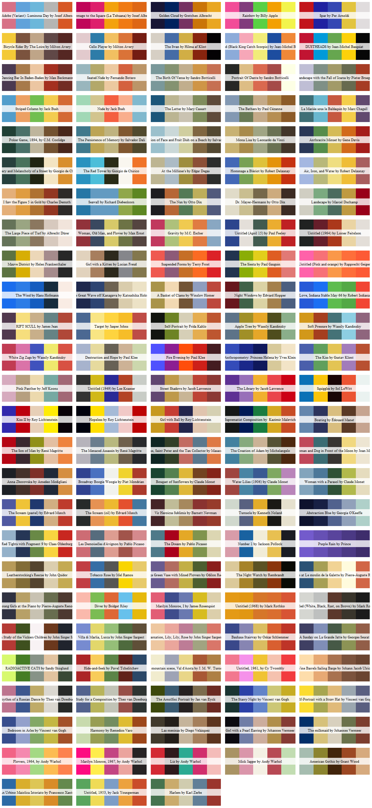
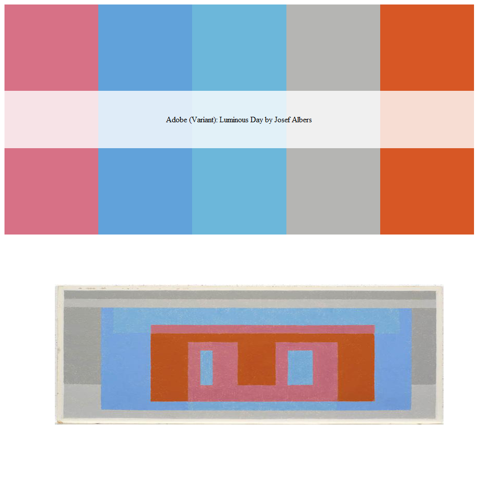
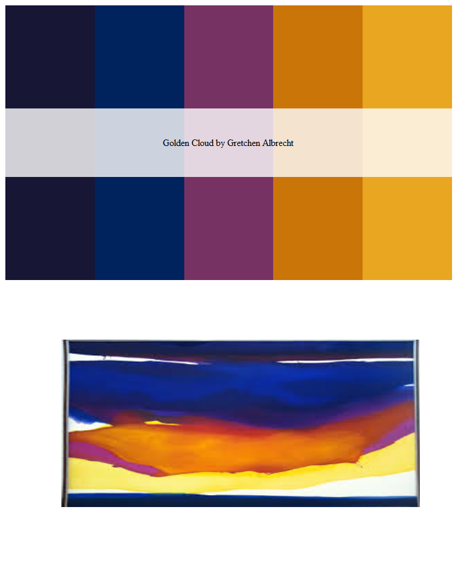
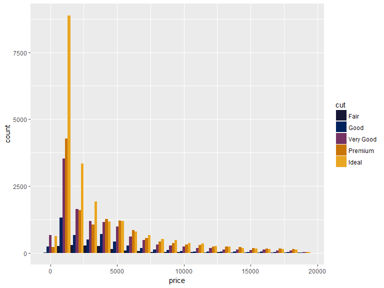

This is a direct replication of the code from [Karthik Ram's `wesanderson` palette](https://github.com/karthik/wesanderson) and [David Miller's `beyonce` palette](https://github.com/dill/beyonce)

But, I generated Colour Palettes using the wonderful and inspirational palettes from [colorlisa.com](http://www.colorlisa.com/)

Installation
------------

``` r
devtools::install_github("skiptoniam/artists")
```

Usage
-----

``` r
library(artists)
```

Here is a complete list of artworks and their colour palettes.

``` r
par(mfrow=c(26,5))
for(i in 1:128) print(artist_palette(i))
```

    ## Adobe (Variant): Luminous Day by Josef Albers

    ## Homage to the Square (La Tehuana) by Josef Albers

    ## Golden Cloud by Gretchen Albrecht

    ## Rainbow by Billy Apple

    ## Spar by Per Arnoldi

    ## Bicycle Rider By The Loire by Milton Avery

    ## Cello Player by Milton Avery

    ## The Swan by Hilma af Klint

    ## Untitled (Black King Catch Scorpio) by Jean-Michel Basquiat

    ## DUSTHEADS by Jean-Michel Basquiat

    ## Dancing Bar In Baden-Baden by Max Beckmann

    ## Seated Nude by Fernando Botero

    ## The Birth Of Venus by Sandro Botticelli

    ## Portrait Of Dante by Sandro Botticelli

    ## Landscape with the Fall of Icarus by Pieter Bruegel

    ## Striped Column by Jack Bush

    ## Nude by Jack Bush

    ## The Letter by Mary Cassatt

    ## The Bathers by Paul Cézanne

    ## La Mariée sous le Baldaquin by Marc Chagall

    ## Poker Game, 1894, by C.M. Coolidge

    ## The Persistence of Memory by Salvador Dalí

    ## Apparition of Face and Fruit Dish on a Beach by Salvador Dalí

    ## Mona Lisa by Leonardo da Vinci

    ## Anthracite Minuet by Gene Davis

    ## Mystery and Melancholy of a Street by Giorgio de Chirico

    ## The Red Tower by Giorgio de Chirico

    ## At the Milliner's by Edgar Degas

    ## Hommage a Blériot by Robert Delaunay

    ## Air, Iron, and Water by Robert Delaunay

    ## I Saw the Figure 5 in Gold by Charles Demuth

    ## Seawall by Richard Diebenkorn

    ## The Nun by Otto Dix

    ## Dr. Mayer-Hermann by Otto Dix

    ## Landscape by Marcel Duchamp

    ## The Large Piece of Turf by Albrecht Dürer

    ## Woman, Old Man, and Flower by Max Ernst

    ## Gravity by M.C. Escher

    ## Untitled (April 15) by Paul Feeley

    ## Untitled (1964) by Lorser Feitelson

    ## Mauve District by Helen Frankenthaler

    ## Girl with a Kitten by Lucian Freud

    ## Suspended Forms by Terry Frost

    ## The Siesta by Paul Gauguin

    ## Untitled (Pink and orange) by Rupprecht Geiger

    ## The Wind by Hans Hofmann

    ## The Great Wave off Kanagawa by Katsushika Hokusai

    ## A Basket of Clams by Winslow Homer

    ## Night Windows by Edward Hopper

    ## Love, Indiana Stable May 66 by Robert Indiana

    ## RIFT SCULL by James Jean

    ## Target by Jasper Johns

    ## Self-Portrait by Frida Kahlo

    ## Apple Tree by Wassily Kandinsky

    ## Soft Pressure by Wassily Kandinsky

    ## White Zig Zags by Wassily Kandinsky

    ## Destruction and Hope by Paul Klee

    ## Fire Evening by Paul Klee

    ## Anthropometry: Princess Helena by Yves Klein

    ## The Kiss by Gustav Klimt

    ## Pink Panther by Jeff Koons

    ## Untitled (1949) by Lee Krasner

    ## Street Shadows by Jacob Lawrence

    ## The Library by Jacob Lawrence

    ## Squiggles by Sol LeWitt

    ## Kiss II by Roy Lichtenstein

    ## Hopeless by Roy Lichtenstein

    ## Girl with Ball by Roy Lichtenstein

    ## Suprematist Composition by  Kazimir Malevich

    ## Boating by Édouard Manet

    ## The Son of Man by René Magritte

    ## The Menaced Assassin by René Magritte

    ## Jesus, Saint Peter and the Tax Collector by Masaccio

    ## The Creation of Adam by Michelangelo

    ## Woman and Dog in Front of the Moon by Joan Miró

    ## Anna Zborowska by Amedeo Modigliani

    ## Broadway Boogie Woogie by Piet Mondrian

    ## Bouquet of Sunflowers by Claude Monet

    ## Water Lilies (1906) by Claude Monet

    ## Woman with a Parasol by Claude Monet

    ## The Scream (pastel) by Edvard Munch

    ## The Scream (oil) by Edvard Munch

    ## Vir Heroicus Sublimis by Barnett Newman

    ## Turnsole by Kenneth Noland

    ## Abstraction Blue by Georgia O'Keeffe

    ## Red Tights with Fragment 9 by Claes Oldenburg

    ## Les Demoiselles d'Avignon by Pablo Picasso

    ## The Dream by Pablo Picasso

    ## Number 1 by Jackson Pollock

    ## Purple Rain by Prince

    ## Leatherstocking's Rescue by John Quidor

    ## Tobacco Rose by Mel Ramos

    ## Large Green Vase with Mixed Flowers by Odilon Redon

    ## The Night Watch by Rembrandt

    ## Dance at Le moulin de la Galette by Pierre-Auguste Renoir

    ## Young Girls at the Piano by Pierre-Auguste Renoir

    ## Diver by Bridget Riley

    ## Marilyn Monroe, I by James Rosenquist

    ## Untitled (1968) by Mark Rothko

    ## Untitled (White, Black, Rust, on Brown) by Mark Rothko

    ## Garden Study of the Vickers Children by John Singer Sargent

    ## Villa di Marlia, Lucca by John Singer Sargent

    ## Carnation, Lily, Lily, Rose by John Singer Sargent

    ## Bauhaus Stairway by Oskar Schlemmer

    ## A Sunday on La Grande Jatte by Georges Seurat

    ## RADIOACTIVE CATS by Sandy Skoglund

    ## Hide-and-Seek by Pavel Tchelitchew

    ## A mountain scene, Val d'Aosta by J. M. W. Turner

    ## Untitled, 1961, by Cy Twombly

    ## Wine Barrels Sailing Barge by Johann Jacob Ulrich

    ## Rhythm of a Russian Dance by Theo van Doesburg

    ## Study for a Composition by Theo van Doesburg

    ## The Arnolfini Portrait by Jan van Eyck

    ## The Starry Night by Vincent van Gogh

    ## Self-Portrait with a Straw Hat by Vincent van Gogh

    ## Bedroom in Arles by Vincent van Gogh

    ## Harmony by Remedios Varo

    ## Las meninas by Diego Velázquez

    ## Girl with a Pearl Earring by Johannes Vermeer

    ## The milkmaid by Johannes Vermeer

    ## Flowers, 1964, by Andy Warhol

    ## Marilyn Monroe, 1967, by Andy Warhol

    ## Liz by Andy Warhol

    ## Mick Jagger by Andy Warhol

    ## American Gothic by Grant Wood

    ## An Urbino Maiolica Istoriato by Francesco Xanto

    ## Untitled, 1953, by Jack Youngerman

    ## Harlem by Karl Zerbe



My only slight tweek is an abilitiy to view the art work your colour palette is based on. This can be achieved by setting `see_painting = TRUE`

This is one of my favorites

``` r
par(mfrow=c(2,1))
artist_palette(1,see_painting = TRUE)
```

    ## Adobe (Variant): Luminous Day by Josef Albers

``` r
library(jpeg)
```

    ## Warning: package 'jpeg' was built under R version 3.2.3

``` r
jj <- readJPEG('./a.jpg',native=TRUE)
plot(0:1,0:1,type="n",ann=FALSE,axes=FALSE)
rasterImage(jj,0,0,1,1)
```



I also really like this one too. Which seems to make nice plots.

``` r
par(mfrow=c(2,1))
artist_palette(3)
```

    ## Golden Cloud by Gretchen Albrecht

``` r
library(jpeg)
jj <- readJPEG('./b.jpg',native=TRUE)
plot(0:1,0:1,type="n",ann=FALSE,axes=FALSE)
rasterImage(jj,0,0,1,1)
```



Here is an example of using this colour palette in `ggplot`.

``` r
library(ggplot2)
```

    ## Warning: package 'ggplot2' was built under R version 3.2.5

``` r
ggplot(diamonds, aes(x = price, fill = cut)) +
  geom_histogram(position = "dodge", binwidth = 1000)+
  scale_fill_manual(values = artist_palette(3))
```


